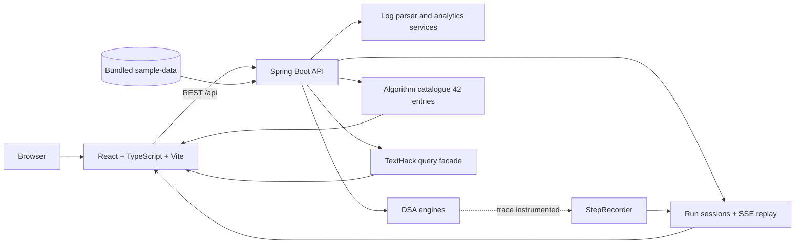

# TextHack — Advanced Algorithms Laboratory

TextHack is a full-stack DSA-3 algorithms laboratory built around **real algorithms, real traces,
and real log data** (formerly the LogInsight Analyzer). Six modules map onto the DSA-3 curriculum
Modules 1–6; every algorithm executes honestly in the backend, trace-instrumented algorithms record
their own execution steps, and the React dashboard **replays those recorded steps** — it never
animates fabricated state.

The repository is intentionally self-contained: the backend keeps runtime data in memory, the sample
datasets live in [`sample-data/`](sample-data/), and the frontend adds no chart or state libraries
(hand-rolled SVG charts). It is an academic/portfolio project, not a production log platform.

## What is implemented

- **Algorithm catalogue** — 42 algorithms across `strings, dp, flow, approximation, randomized,
  parallel`, served by `GET /api/modules` and `GET /api/algorithms` with module order/labels/accents
  as one source of truth.
- **TextHack console** — six natural-style query classes (Pattern Search, Fuzzy Match, Document
  Similarity, Dependency Flow, Project Scheduling, Prime Testing) that each route to one real engine.
- **Run Sessions** — every trace-instrumented execution is stored (max 64) and replayable either
  from the full record or streamed live over **SSE** (`meta / step / complete`).
- **Laboratory + TraceStudio** — step-by-step replay with keyboard navigation, an operation ledger,
  variable inspector, and education panels; deep-linkable per algorithm or per module.
- **Course Map** — every syllabus row maps to a real implementation, test, endpoint, and UI page.
- **Log intelligence** — ingestion, parsing and analytics over the bundled text/JSONL samples.
- **Benchmarks** — sequential-vs-parallel sweeps with measured speedup, work, span, parallelism.

## Architecture



There is no database or JPA layer. The backend is an in-memory service designed to make algorithm
behavior inspectable.

## Modules (DSA-3 mapping)

| Module | Title | Accent | Traceable | Highlights |
| --- | --- | --- | --- | --- |
| strings | String Algorithms | `#22d3ee` | 4 | Naive, KMP, Z, Rabin-Karp (cross-verified), Aho-Corasick, suffix array |
| dp | Dynamic Programming | `#a78bfa` | 2 | Levenshtein, Needleman-Wunsch, Matrix Chain, TSP/Hamiltonian, tree/SOS DP |
| flow | Graph & Flow | `#fbbf24` | 3 | Ford-Fulkerson, Edmonds-Karp, Dinic (cross-verified), min-cut, matching, min-cost flow |
| approximation | Approximation | `#34d399` | 1 | VC 2-approx, bounded VC, kernelization, knapsack FPTAS, VC⇄IS reduction |
| randomized | Randomized | `#f472b6` | 3 | Miller-Rabin, reservoir sampling, universal/FKS hashing, randomized quicksort |
| parallel | Parallel | `#60a5fa` | 0 | prefix scan, merge-sort, reduce with work/span analysis |

The full matrix, status marks (`trace` / `api` / `lib`) and cross-verification chains are in
[`docs/COURSE_MAP.md`](docs/COURSE_MAP.md). The trace contract and replay pipeline are explained in
[`docs/TRACE_ENGINE.md`](docs/TRACE_ENGINE.md).

## Technology stack

| Layer | Technologies |
| --- | --- |
| Backend | Java 21, Spring Boot 3.5.16, Spring Web |
| Frontend | React 18, TypeScript, Vite, React Router (no chart/state libraries) |
| Data | In-memory services and bundled sample datasets; no external database |
| Quality | JUnit/Spring Boot tests, Maven Wrapper, JaCoCo configuration |

## Run locally

Prerequisites: Java 21 or newer and Node.js 18 or newer.

Start the backend:

```bash
cd backend
./mvnw spring-boot:run       # Linux/macOS
mvnw.cmd spring-boot:run     # Windows
```

The API listens on `http://localhost:8080`.

Start the frontend in a second terminal:

```bash
cd frontend
npm install
npm run dev
```

Open `http://localhost:5173`. Vite proxies `/api` requests to the backend.

## Representative API surface

The complete endpoint mapping is documented in [`docs/12-api-documentation.md`](docs/12-api-documentation.md)
(section 12 covers the TextHack laboratory surface).

| Method | Endpoint | Purpose |
| --- | --- | --- |
| `GET` | `/api/modules`, `/api/algorithms` | module framing + 42 algorithm descriptors |
| `POST` | `/api/text-hack/query` | one of six engine-scoped query classes |
| `POST` | `/api/runs` | execute + store a trace-instrumented run |
| `GET` | `/api/runs`, `/api/runs/{id}` | run history and full record |
| `GET` | `/api/runs/{id}/events` | SSE replay (`meta` → `step`×n → `complete`) |
| `GET` | `/api/trace/catalog` | list traceable algorithms |
| `POST` | `/api/search/kmp` | execute a string-search engine |
| `POST` | `/api/benchmark/run` | run the benchmark service |

## Testing and builds

```bash
cd backend
./mvnw.cmd clean verify      # Windows (./mvnw clean verify on Linux/macOS)

cd ../frontend
npm run build
```

Current verification: **696 backend tests / 0 failures** (`mvn -q verify`), TypeScript + Vite
production build clean. Run the commands above against the current checkout for the latest result.

## Project structure

```text
backend/
  src/main/java/com/loginsight/
    catalog/          algorithm + module descriptors
    controller/       REST controllers (incl. Catalog/TextHack/Run)
    service/          log, dataset, analytics, text-hack, run, trace services
    dsa/              algorithm implementations (scope-guarded java.util surface)
    query/engine/     algorithm-specific query engines
    trace/            step recording and trace catalog
  src/test/           backend unit and integration tests (696)
frontend/
  src/api/            typed API client (incl. SSE parser) and wire types
  src/pages/          Command Center, TextHack, Laboratory, Run Sessions,
                      Course Map, + analytics/logs/datasets/benchmarks/system/docs
  src/components/     layout, charts, UI, and TraceStudio player
sample-data/          bundled input datasets
docs/                 requirements, architecture, API, DSA, testing, benchmarks
```

## Engineering notes

- Results are computed by the selected engine; the UI does not synthesize algorithm output.
- Trace playback replays **recorded** steps; `truncated` is set by the recorder, never guessed.
- Probabilistic algorithms say so (`PROBABLY_PRIME`); approximation algorithms report their ratio
  and lower bound; library-only algorithms are labeled `lib` in the UI.
- The in-memory design keeps the project reproducible and experiments easy to run, but it is not
  intended for multi-instance deployment or unbounded log retention (run history is capped at 64).

Additional documentation:

- [Rebuild baseline](docs/REBUILD_BASELINE.md) · [Research principles](docs/RESEARCH.md)
- [Course map](docs/COURSE_MAP.md) · [Trace engine](docs/TRACE_ENGINE.md) · [Final rebuild report](docs/FINAL_REBUILD_REPORT.md)
- [Engineering decisions](docs/ENGINEERING_DECISIONS.md) · [Interview guide](docs/INTERVIEW_GUIDE.md)

GitHub Actions runs the backend Maven verification and frontend production build for pushes and pull
requests.

## Author

**Karkala Shiva Reddy** — [GitHub](https://github.com/karkalashivareddy)