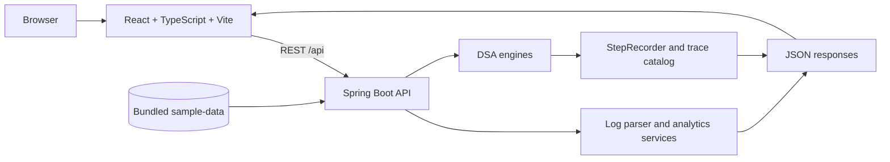

# LogInsight Analyzer

LogInsight Analyzer is a full-stack log-analysis laboratory built around executable data-structures and algorithms. It ingests bundled text/JSONL log datasets, normalizes events, exposes algorithmic analysis through a Spring Boot API, and presents the results in a React dashboard with trace playback and benchmark views.

The repository is intentionally self-contained: the backend keeps runtime data in memory and the sample datasets live in [`sample-data/`](sample-data/). It is an academic/portfolio project, not a production log platform.

## What is implemented

- Log ingestion and parsing for the bundled text and JSONL samples.
- Analytics for service dependencies, errors, top frequencies, and time windows.
- A typed React/Vite frontend with overview, logs, analytics, datasets, laboratory, benchmark, system, and documentation pages.
- Algorithm endpoints that execute the selected implementation against the request data.
- Trace recording for selected algorithms through `StepRecorder`, then replay in the Algorithm Laboratory.
- Sequential-versus-parallel benchmark requests and a dataset management API.

## Architecture



There is no database or JPA layer in the current implementation. The backend is an in-memory service designed to make algorithm behavior inspectable.

## Algorithm coverage

The implementations are organized under `backend/src/main/java/com/loginsight/dsa/` and `backend/src/main/java/com/loginsight/query/engine/`.

| Area | Implemented examples |
| --- | --- |
| String search | Naive search, KMP, Z-algorithm, Rabin-Karp, Aho-Corasick, suffix-array search, fuzzy/edit-distance search |
| Dynamic programming | Levenshtein, Damerau, weighted edit distance, global/local alignment, matrix-chain ordering, optimal BST, bitmask TSP, Hamiltonian path, tree DP, rerooting DP, SOS DP |
| Graph and flow | Ford-Fulkerson, Edmonds-Karp, Dinic, min-cut, bipartite matching, min-cost flow |
| Approximation | Vertex-cover approximation, incident-cover variants, set cover, and supporting reductions |
| Randomized | Randomized quicksort, Miller-Rabin, reservoir sampling, and universal hashing |
| Parallel | Parallel reduce, prefix scan, and merge-sort-style endpoints |

The trace catalog is the authoritative list of algorithms that currently expose step-by-step execution. It is available from `GET /api/trace/catalog`.

## Technology stack

| Layer | Technologies |
| --- | --- |
| Backend | Java 21, Spring Boot 3.5.16, Spring Web |
| Frontend | React 18, TypeScript, Vite, React Router |
| Data | In-memory services and bundled sample datasets; no external database |
| Quality | JUnit/Spring Boot tests, Maven Wrapper, JaCoCo configuration |

## Run locally

Prerequisites: Java 21 or newer and Node.js 18 or newer.

Start the backend:

```bash
cd backend
./mvnw spring-boot:run       # Linux/macOS
mvnw.cmd spring-boot:run     # Windows
```

The API listens on `http://localhost:8080`.

Start the frontend in a second terminal:

```bash
cd frontend
npm install
npm run dev
```

Open `http://localhost:5173`. Vite proxies `/api` requests to the backend.

## Representative API surface

All algorithm endpoints accept JSON bodies defined by the controller/request model that owns the endpoint. The complete endpoint mapping is documented in [`docs/12-api-documentation.md`](docs/12-api-documentation.md).

| Method | Endpoint | Purpose |
| --- | --- | --- |
| `GET` | `/api/health` | Basic service health |
| `GET` | `/api/logs`, `/api/logs/stats` | Read log events and summary statistics |
| `GET` | `/api/analytics/dependencies` | Build service dependency information |
| `POST` | `/api/search/kmp` | Execute a string-search engine |
| `POST` | `/api/dp/levenshtein` | Execute a dynamic-programming engine |
| `POST` | `/api/flow/dinic` | Execute a flow algorithm |
| `GET` | `/api/trace/catalog` | List traceable algorithms |
| `POST` | `/api/benchmark/run` | Run the benchmark service |

## Testing and builds

```bash
cd backend
./mvnw clean verify       # Linux/macOS
mvnw.cmd clean verify     # Windows

cd ../frontend
npm run build
```

The Maven `verify` lifecycle includes the configured JaCoCo report. The repository does not claim a fixed test count or coverage percentage; run the commands above against the current checkout for the latest result.

## Project structure

```text
backend/
  src/main/java/com/loginsight/
    controller/       REST controllers
    service/          log, dataset, analytics, benchmark, and trace services
    dsa/              algorithm implementations
    query/engine/     algorithm-specific query engines
    trace/            step recording and trace catalog
  src/test/           backend unit and integration tests
frontend/
  src/api/            typed API client and wire types
  src/pages/          application routes
  src/components/     layout, charts, UI, and trace player
sample-data/          bundled input datasets
docs/                 requirements, architecture, API, DSA, testing, and benchmarks
```

## Engineering notes

- Results are computed by the selected engine; the UI does not synthesize algorithm output.
- Trace playback is implemented by recording execution steps in the backend and sending those records to the frontend.
- The in-memory design keeps the project reproducible and makes algorithm experiments easy to run, but it is not intended for multi-instance deployment or unbounded log retention.
- For a larger deployment, persistence, authentication, streaming ingestion, and bounded resource policies would be the next engineering concerns.

## Author

**Karkala Shiva Reddy** — [GitHub](https://github.com/karkalashivareddy)
