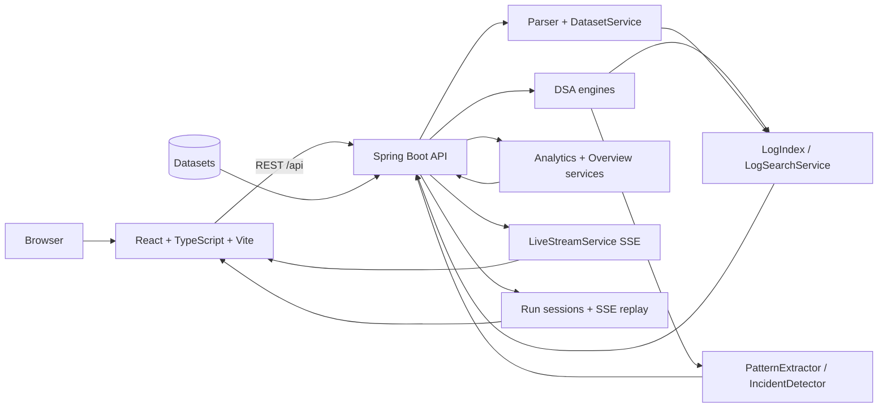

# LogInsight Analyzer

LogInsight Analyzer is a full-stack **algorithmic log intelligence and search** platform built for
the DSA-3 curriculum. It applies core data-structure and algorithm theory — string matching,
edit-distance, heaps/priority windows, token-pattern analysis — to a real (in-memory) log dataset,
and serves it through a React dashboard. The architecture is a product shell around the DSA-3
engines: the same algorithms are exposed both through product features (search, patterns,
incidents) and through the Algorithm Insights catalogue and measured benchmarks.

The repository is intentionally self-contained: the backend keeps runtime data in memory, the demo
and sample datasets live in [`sample-data/`](sample-data/), and the frontend adds no chart or state
libraries (charts are hand-rolled SVG). Academic/portfolio project, not a production log platform.

## What is implemented

- **Command Center** — live dashboard (`GET /api/overview`): event/error/service/host totals,
  traffic timeline, severity distribution, HTTP status codes, top patterns, recent critical events
  and a 7×24 activity heatmap. Every number is computed live from the loaded dataset.
- **Log Explorer** — structured filters, time-window, paging and free-text search
  (`GET /api/logs/explore`) over the loaded dataset, with per-event detail views
  (`GET /api/logs/{id}`).
- **Search** — product search (`POST /api/search`) whose DSA engine executes the user's pattern
  over the rendered dataset haystack. Reports the measured strategy (Naive/KMP/Z/Rabin-Karp),
  pattern length, text size and duration; a Levenshtein **"did you mean"** suggestion appears on a
  miss; a typeahead feeds suggestions from `GET /api/search/suggest`.
- **Analytics** — traffic timeline, severity, 7×24 heatmap, HTTP (status/methods/endpoints with
  measured latency percentiles) and per-host rollups.
- **Patterns** — heuristic (rule/token-based) message-structure discovery, labelled honestly as
  not ML; drill into sample events per template (`GET /api/patterns`, `/examples`).
- **Incidents** — windowed elevated-error detection (5-minute windows against the dataset's own
  baseline), each with its supporting logs for verification (`GET /api/incidents`).
- **Services** — per-service rollups and a drill-down detail with a 24-hour activity series.
- **Live Stream** — labelled SSE replay of the dataset (`source: demo-replay`, "not real-time").
- **Datasets / Ingestion** — one-click deterministic demo corpus, file upload (JSONL or canonical
  text, parser auto-detected), clear, and honest parse summaries (failed lines reported).
- **Analysis** — algorithm catalogue grouped by module, measured search benchmark (four matchers,
  same haystack, same pattern), and recorded **Run Sessions** replayed step-by-step over SSE.
- **System / Docs** — status and build information plus product documentation.

## Architecture



There is no database or JPA layer. `DatasetService` holds one in-memory dataset; `LogIndex`
provides position lists and time-window lookups; `LogSearchService` combines index filters with a
DSA matcher over the rendered haystack.

## Technology stack

| Layer | Technologies |
| --- | --- |
| Backend | Java 21, Spring Boot 3.5, Spring Web |
| Frontend | React 18, TypeScript, Vite, React Router (no chart/state libraries) |
| Data | In-memory dataset; demo corpus and bundled samples; no external database |
| Quality | JUnit / Spring Boot tests, Maven Wrapper, JaCoCo configuration |

## Run locally

Prerequisites: Java 21 or newer and Node.js 18 or newer.

```bash
cd backend
mvnw.cmd spring-boot:run      # Windows (./mvnw spring-boot:run on Linux/macOS)
```

The API listens on `http://localhost:8080`.

In a second terminal:

```bash
cd frontend
npm install
npm run dev
```

Open `http://localhost:5173`. Vite proxies `/api` requests to the backend. Load the **Demo
Dataset** from the Datasets or Ingestion screen to see every screen populated with honest data.

## API surface (summary)

The full wire contract is documented in [`docs/API.md`](docs/API.md).

| Method | Endpoint | Purpose |
| --- | --- | --- |
| `GET` | `/api/overview?range=` | dashboard snapshot (`404` when no dataset) |
| `GET` | `/api/logs`, `/api/logs/explore`, `/api/logs/{id}` | explorer + single event |
| `POST` | `/api/search` · `GET` `/api/search/suggest` | product search + typeahead |
| `GET` | `/api/patterns[/examples]` | message patterns |
| `GET` | `/api/incidents[/count|/{id}|/{id}/logs]` | incident detection + evidence |
| `GET` | `/api/services`, `/api/services/{name}` | service health |
| `GET` | `/api/analytics/http|hosts|heatmap|windows|top|errors|dependencies` | analytics |
| `GET` | `/api/live` (SSE) · `/api/live/status` | live replay stream |
| `GET` | `/api/ingestion/status` · `POST` `/api/ingestion/demo` | ingestion status/demo |
| `GET` | `/api/datasets` · `POST` `/api/datasets` · `POST` `/api/datasets/demo` | dataset options |
| `GET` | `/api/analysis/algorithms` · `/api/analysis/benchmarks/search` | laboratory + benchmark |
| `POST` | `/api/runs` · `GET` `/api/runs` · `GET` `/api/runs/{id}/events` | run sessions + SSE replay |
| `GET` | `/api/analysis/…`, `/api/trace/catalog` | DSA engine catalogue |

## Testing and builds

```bash
cd backend
.\mvnw.cmd -o clean verify     # Windows (./mvnw -o clean verify on Linux/macOS)

cd ../frontend
npm run build
```

Current verification: **732 backend tests / 0 failures**, TypeScript + Vite production build
clean. Run the commands above against the current checkout for the latest result.

## Project structure

```text
backend/
  src/main/java/com/loginsight/
    analytics/        Timeline, Severity, Heatmap, Fleet analyzers (pure Java)
    index/            LogIndex position lists + time-window lookups
    search/           SearchQueryParser, LogSearchService (product search)
    pattern/          PatternExtractor (heuristic token normalisation)
    incident/         IncidentDetector (windowed baseline thresholding)
    datasets/         DemoDatasetGenerator
    service/          LogService, DatasetService, OverviewService, IncidentsService,
                      LiveStreamService, SearchBenchmarkService, ...
    controller/       REST controllers mapped 1:1 to docs/API.md
    dsa/              algorithm implementations (scope-guarded java.util surface)
    dto/              wire records (response + request)
  src/test/           unit + integration tests (732)
frontend/
  src/api/            typed API client (incl. SSE parsers) and wire types
  src/pages/          Overview, Logs, Search, Analytics, Patterns, Incidents, Services,
                      Live, Datasets, Ingestion, Analysis, Algorithms, Benchmarks, Runs, ...
  src/components/     layout, hand-rolled SVG charts, TracePlayer, formatters
  src/styles/         global.css (dark control-room palette)
sample-data/          bundled input datasets
docs/                 architecture, API, dataset, algorithms, UI/UX and reports
```

## Engineering notes

- Product features are **never** fabricated: every count, latency, benchmark time and incident
  derives from the loaded dataset or a measured run. Demo data is labelled; the live stream is a
  labelled replay (`demo-replay`, "not real-time").
- Incident detection is heuristic and labelled as such; patterns are token-based heuristics, not ML.
- The DSA layer is inspectable: the Algorithm Catalogue, measured search benchmark and run-session
  replay expose exactly which algorithm ran, on what haystack, and how long it measured.
- The in-memory design keeps the project reproducible; it is not intended for multi-instance
  deployment or unbounded retention (run history capped at 64).

Additional documentation:

- [Architecture](docs/ARCHITECTURE.md) · [API](docs/API.md) · [Dataset](docs/DATASET.md)
- [Algorithms](docs/ALGORITHMS.md) · [UI/UX](docs/UI-UX.md)
- [LogInsight rebuild report](docs/LOGINSIGHT_REBUILD_REPORT.md) · [Rebuild baseline](docs/REBUILD_BASELINE.md)
- [Course map](docs/COURSE_MAP.md) · [Trace engine](docs/TRACE_ENGINE.md) · [Final rebuild report](docs/FINAL_REBUILD_REPORT.md)

GitHub Actions runs the backend Maven verification and the frontend production build for pushes and
pull requests.

## Author

**Karkala Shiva Reddy** — [GitHub](https://github.com/karkalashivareddy)