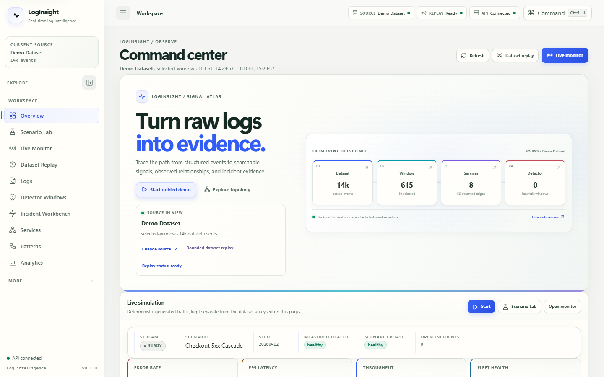

# LogInsight

**Real-Time Log Intelligence & Incident Investigation Platform**

Academic project for **Data Structures and Algorithms-3 (`25CS2103E`)**, 2026-2027 odd
semester, Koneru Lakshmaiah Education Foundation (KL University), KLH Campus.
The submission deliverables, student roster and course record are in
[final-submission/FINAL_SUBMISSION_INDEX.md](final-submission/FINAL_SUBMISSION_INDEX.md).

LogInsight is a full-stack, in-memory log investigation workspace. It combines a React 18 + TypeScript + Vite shell with a Java 21 Spring Boot REST/SSE API, classical data-structure and algorithm engines, and a backend-owned dataset lifecycle.

The platform ingests a dataset or runs a deterministic generated scenario, streams it as a distinct simulation mode, detects elevated-error windows with supporting evidence, and presents results with source, scope and provenance context.

> Academic/portfolio software. The Docker artifacts are a single-node deployment shape, not a claim of production scale or public deployment.

## Visual direction

The current interface uses **Signal Atlas**, a light-first porcelain and cobalt design system with an optional dark 3D topology surface. Start **Guided Demo** from the Command Center to walk through real dataset, search, analytics, observed topology, incident, and algorithm trace APIs. Current screenshots are in [`docs/images/signal-atlas/`](docs/images/signal-atlas/); older images are historical and do not depict this revision.



## The problem

During an outage, the log lines needed to explain what happened are spread across services, arrive interleaved and out of order, and are queried far faster than a human can read them. LogInsight applies classical algorithms to that work — multi-pattern and exact-substring search, bounded edit distance, streaming window aggregation, and dependency-graph traversal — and presents returned events, aggregates and algorithm evidence with their source and scope.

The intended workflow is:

**Ingest → Observe → Detect → Investigate → Explain → Act → Verify**

Ingest a dataset or start a generated scenario, observe service health and live metrics, let the detector raise a window, investigate the evidence behind it, explain it with the algorithm evidence and dependency graph, act through an explicit operator lifecycle, then verify that measured metrics returned to a healthy level. The application does not claim to identify a root cause on its own; it reports measured evidence and leaves attribution to the operator.

## Technology stack

| Layer | Technology |
|---|---|
| Frontend | React 18, TypeScript, Vite, React Router, hand-rolled SVG charts, Three.js (lazy-loaded WebGL topology), Vitest + Testing Library, Playwright |
| Backend | Java 21, Spring Boot 3.5 (REST + Server-Sent Events), in-memory dataset store, JUnit 5 |
| Data | Backend-held in-memory dataset, JSONL and pipe-delimited uploads, bundled `sample-data/` samples |
| Transport | HTTP REST plus three SSE endpoints. No WebSocket, no external log collector, no cloud integration |

## Architecture

Three layers, one rule: **telemetry is server-owned.** The backend generates deterministic scenarios, computes product aggregates, executes algorithm paths and manages process-local incident state. The browser renders API responses with their scope and provenance; only the features that invoke an algorithm claim its execution evidence.

```text
Browser (React SPA)
  ├─ REST  /api/*          dataset, analytics, catalogue, simulation control
  └─ SSE   /api/simulation/stream   generated simulation frames
         /api/live                  dataset replay
         /api/runs/{id}/events      recorded trace replay
                    │
        Vite dev proxy / Nginx      (proxy buffering disabled for SSE)
                    │
Spring Boot single process
  ├─ DatasetService · LogIndex         one current in-memory dataset
  ├─ LiveSimulationService             session, RollingWindow, SimulationDetector,
  │                                    IncidentLifecycleStore   -> frames + incidents
  ├─ Analytics · IncidentDetector      dataset-derived windows
  └─ QueryDispatcher · 35 engines      catalogue, traces, RunStore
```

Three SSE surfaces, and they are not interchangeable: the **generated simulation**, the **dataset
replay**, and **recorded trace replay**. Simulation sessions are bounded by a fixed thread pool with a
bounded queue, retained for a bounded number of sessions for operator actions, and released on shutdown.

Full detail: [docs/ARCHITECTURE.md](docs/ARCHITECTURE.md) and
[docs/ARCHITECTURE_DIAGRAM.md](docs/ARCHITECTURE_DIAGRAM.md).

## Features

The shell is a light-first observability workspace. Sidebar labels below are the real navigation names.

- **Overview** — selected-window operations view over the loaded dataset, with a live simulation band.
- **Guided Demo** — a repeatable route-by-route walkthrough; it uses backend dataset, search, analytics, dependency, incident and trace-catalogue operations and shows each response as evidence.
- **Scenario Lab** — scenario catalogue and run controls for the deterministic generated simulation.
- **Live Monitor** — the generated simulation stream: stream state, scenario, seed, speed, tick, phase, error rate, throughput, p95, signals, evidence, incident, event stream and topology.
- **Dataset Replay** — a bounded, labelled replay of the loaded dataset. Not a live collector.
- **Logs** — indexed explorer with filters, paging and event detail.
- **Algorithmic Search** — structured fields, KMP free text, typeahead and the Levenshtein suggestion.
- **Analytics** — timeline, severity, heatmap, HTTP and hosts.
- **Patterns** and **Detector Windows** — heuristic results with evidence; dataset incident detail is reachable at `/incidents`, `/incidents/:id` and the alias `/investigate/:id`.
- **Incident Workbench** — the investigation surface: incident navigator, measured detail with lifecycle, timeline and algorithm evidence, and context with origin, affected services, blast radius, topology and health.
- **Services** — fleet rollups and per-service activity.
- **Algorithm Lab**, **Algorithms**, **Benchmarks**, **Run Sessions** — the catalogue, the measured matcher benchmark and recorded traces.
- **Datasets**, **Ingestion**, **System**, **Documentation**.

Hand-rolled SVG charts, and a service topology with a 2D SVG default plus an on-demand Three.js/WebGL
view, an accessible service list and a 2D fallback. Topology provenance is labelled: dataset surfaces
show `OBSERVED DEPENDENCIES`, simulation surfaces show `DECLARED DEPENDENCIES`. There is no WebSocket
client.

The canonical route and implementation audit is [docs/IMPLEMENTATION_AUDIT.md](docs/IMPLEMENTATION_AUDIT.md). The API contract is [docs/API.md](docs/API.md). See [docs/COMMAND_CENTER.md](docs/COMMAND_CENTER.md) for the Overview semantics.

## Command Center

`/` and `/command-center` are a selected-window operations view built only from returned dataset and runtime data.

- **Selected window**: `range=5m|15m|1h|6h|24h` (default `1h`). `windowEnd` is the newest event timestamp in the loaded dataset and `windowStart` is `windowEnd - range`, so the window is a trailing slice of the data, not of the wall clock. `scope` is the literal `selected-window`.
- **Window-scoped counts**: `events`, `errors`, `warnings`, `services`, `hosts`, `severity`, `statusCodes`, `topServices`, `topPatterns`, `recentCritical`, the timeline and the heatmap are all computed over that window only.
- **`datasetEvents`** is the unfiltered size of the loaded dataset. The UI uses it to show selected-window coverage as a percentage of the whole dataset.
- **`eventsPerMinute`** is `window events / (range width in minutes)`. It is a rate over the nominal range width, not a measured inter-arrival rate over the observed span, so it reads low when events cluster near `windowEnd`.
- **Real health vs compatibility status**: `OverviewDto.systemStatus` is a compatibility field the backend always sets to `"Operational"`. Runtime health is `GET /api/health/status`, which reports `status`, `uptimeMillis`, `datasetLoaded`, `datasetName`, `datasetSize` and the registered engine count. The Overview header prefers the real health value and falls back to the compatibility string only when the health request has not resolved.
- **Observed request-trail topology**: nodes and edges come from `GET /api/analytics/dependencies`, which groups events by `requestId` and links consecutive distinct services. Node size follows observed event counts and edge width/opacity follow the observed adjacency weight. This is co-occurrence inside log data, not verified infrastructure topology.
- **Static topology encoding**: node size and edge weight reflect backend values; markers are static so a loaded dataset is not mistaken for ongoing traffic. The render budget caps at 250 nodes and 2,500 edge records and discloses omitted input records.
- **Pipeline story**: a Load → Observe → Detect → Investigate strip links each Overview figure to the page that produced it.
- **Shared replay context**: Overview and Dataset Replay read one `ReplayProvider` subscription, so a replay started on either screen is visible on both.

The topology panel renders an interactive 2D SVG by default. Its optional Three.js/WebGL view is lazy-loaded and disposes renderer resources, controls, geometry, materials, observers and listeners on unmount. If WebGL is unavailable, the same backend data remains available through 2D and accessible lists. Edges describe request-trail associations, not verified infrastructure or causality. See [docs/design-system.md](docs/design-system.md) for visual encodings and constraints.

## Run locally

Prerequisites: Java 21 or newer, Node.js 22.12 or newer for the Vitest suite, and npm.

### Backend

```powershell
cd backend
.\mvnw.cmd spring-boot:run
```

The API listens on `http://localhost:8080`.

### Frontend

In a second terminal:

```powershell
cd frontend
npm install
npm run dev
```

Open `http://localhost:5173`. The Vite development server preserves the local proxy: `/api` is forwarded to `http://localhost:8080`, so the browser uses same-origin API paths in development.

### Browser E2E checks

With the backend and frontend running as above, install the browser once and run the real browser workflows:

```powershell
cd frontend
npx playwright install chromium
npm run test:e2e
npm run capture:visuals
```

The suite loads the reproducible backend demo corpus, then checks the Command Center, direct route refresh, dataset-backed search and event details, service selection, WebGL fallback, guided-presentation exit, mobile navigation, reduced motion and all six requested viewport sizes. It is sequential because the backend keeps one active in-memory dataset. CI provisions Chromium and both services automatically. Test output and failure traces are written under `frontend/test-results/`. The capture script saves current desktop, mobile, topology, incident and guided-presentation screenshots from the running backend/frontend into `docs/images/signal-atlas/`.

Load a source from **Datasets** or **Ingestion**. The application starts with no dataset; dataset-backed product endpoints do not invent first-run metrics.

To see the real-time product without loading data, open **Scenario Lab** and press *Start run*: the backend generates a scenario, streams measured frames, and opens an incident. Then open **Incident Workbench** (`/incidents/workbench`) for the investigation surface. Dataset incident detail is reachable at `/incidents`, `/incidents/:id` and the alias `/investigate/:id`, all of which render the same detail view.

## Run with Docker Compose

Docker Compose uses two images:

- `backend/Dockerfile` is a multi-stage Maven build with a non-root Java 21 runtime. The repository `sample-data/` directory is copied into `/app/sample-data` and selected with `LOGINSIGHT_SAMPLE_DATA_DIR`.
- `frontend/Dockerfile` is a multi-stage Node build with a non-root Nginx runtime. `frontend/nginx.conf` serves the SPA, proxies `/api/` to the backend service, disables proxy buffering for SSE, and falls back to `index.html` for client routes.

```powershell
Copy-Item .env.example .env
docker compose up --build -d
docker compose ps
```

Open `http://localhost:8088`. The default host mappings are backend `8080` and frontend `8088`; change them in `.env` when needed. See [docs/DEPLOYMENT.md](docs/DEPLOYMENT.md) for healthchecks, operations and limitations.

The Compose file was syntax-validated with `docker compose config`. The Docker daemon was not available in the audit environment, so image builds and live container smoke tests were not run here.

## Data and replay honesty

- **Demo Dataset**: 14,000 deterministic synthetic events generated by `DemoDatasetGenerator` with seed `20260913L`, re-anchored to the current hour. It is not production telemetry.
- **Bundled samples**: committed text and JSONL files under `sample-data/`, selectable from the Datasets screen.
- **Upload**: multipart JSONL or canonical pipe-delimited text. The parser reports successful and failed line counts.
- **Current state**: one dataset is held in backend memory at a time. Restarting the backend clears it.
- **Dataset Replay**: a bounded Server-Sent Events replay of the loaded dataset, emitted oldest-first by `(timestamp, id)`. It is labelled `demo-replay` and "not real-time" in the API and UI. It is not an external log collector, WebSocket feed, or live ingestion path.
- **Shared replay state**: `ReplayProvider` in `frontend/src/replay/ReplayContext.tsx` owns the single subscription, the recent-event buffer (capped at 300) and the dataset-invalidation reset. Overview and Dataset Replay are two views of that one subscription, not two streams.

### Terminology

These documents distinguish two separate data modes and never use one name for the other:

- **Dataset Replay** — a bounded replay of the *loaded dataset*. Route `/replay`, sidebar label `Dataset Replay`, backend reports `source: demo-replay`, and the UI shows a "not real-time" disclosure.
- **Live Monitor** — the *deterministic generated simulation*. Route `/live`, sidebar label `Live Monitor`, backend reports `source: live-simulation`. It is generated from a scenario definition plus a seed, not captured from any external system.

`/live` is **not** the dataset replay route. Dataset replay lives at `/replay`. Scenario configuration and run control live at `/scenario-lab` (alias `/simulation`).

## API behavior

All browser API calls use `/api`. Dataset-backed requests return a safe JSON error when no dataset is loaded. The normal error shape is:

```json
{
  "status": 404,
  "error": "DatasetException",
  "message": "No dataset loaded",
  "timestamp": "2026-09-25T00:00:00Z",
  "path": "/api/overview"
}
```

The current handler maps validation and malformed requests to `400`, missing dataset state to `404`, unsupported methods/media to `405`/`415`, and unexpected failures to a sanitized `500`. Upload size is 64 MB, product-search pages use `size=1..200`, log slices use `limit=1..1000`, replay controls are validated at `batchSize=1..200` and `intervalMs=100..60000`, and run history is capped at 64 records. The complete contract and limit table are in [docs/API.md](docs/API.md).

## Algorithms

### DSA-3 relationship

The six catalogue modules map directly onto the DSA-3 subject groupings: **Strings**, **Dynamic Programming**, **Graph & Flow**, **Approximation**, **Randomized**, and **Parallel**. Each descriptor is classified as a **product feature** (genuinely exercised by a product path), an **algorithm engine** (a real REST or trace endpoint that a user or a run session can invoke), or an **academic lab** entry (implemented and tested, but not wired into a product panel). The per-algorithm classification is in [docs/DSA_PRODUCT_MAPPING.md](docs/DSA_PRODUCT_MAPPING.md), and the subject-by-subject breakdown is in [docs/04-dsa-mapping.md](docs/04-dsa-mapping.md). No algorithm is presented as a product capability unless a product path actually calls it.

The backend catalogue contains **42 descriptors** across six modules, **36** reachable through a REST or trace endpoint, **35** registered dispatch keys, and **13** trace-instrumented. The four numbers describe different things, so they are reconciled here rather than left to look like a contradiction:

- **42 → 36 reachable**: the remaining 6 are library-only implementations with no endpoint (`kasai_lcp`, `bounded_vertex_cover`, `vertex_cover_kernelization`, `knapsack_fptas`, `vc_is_reduction`, `perfect_hash`). They are tested and catalogued, and the UI marks them as not reachable rather than offering a panel that would fail.
- **36 → 35 dispatch keys**: `suffix_array` and `suffix_search` are two catalogue entries served by **one** engine, since they are the same algorithm's build and query phases.

Product-facing algorithm use is intentionally narrower than any of those counts:

- KMP powers free-text product search.
- Levenshtein powers the zero-result “Did you mean?” suggestion.
- Heuristic token normalization powers Patterns; it is not ML.
- Five-minute baseline thresholding powers Incidents; it is rule-based and exposes evidence.
- Group-by-`requestId` adjacency folding builds the Command Center topology; it is a deterministic pass over the log, not a service registry.
- Aho-Corasick multi-pattern search and a rolling sliding-window aggregate power the generated simulation's evidence panel, and declared-graph BFS computes the incident blast radius. These are simulation-path algorithms, not claims about observed infrastructure.
- Naive, KMP, Z and Rabin-Karp are compared by one measured run per matcher over the loaded dataset.
- The remaining catalogue entries are exposed algorithm engines, library-only implementations, or trace/run-session capabilities; they are not all claimed to drive a product panel.
- The course rule against `java.util` delegation in `dsa/**` is enforced by `EngineScopeGuardTest`: it freezes today's exact `java.util` imports per `dsa` source file in a manifest, fails the build on any new `java.util` import under `dsa/`, and allows the ledger to shrink. `java.util.concurrent` (parallel) and `java.util.Random` (randomized) are course-licensed and recorded in that manifest.

The implementation inventory and exposure rules are in [docs/ALGORITHMS.md](docs/ALGORITHMS.md). The frontend includes a Three.js/WebGL topology view; there is no WebSocket transport, external research integration, trained ML model, or production telemetry integration.

## Verification

**Local verification** — the frontend and backend were run in this execution environment on the redesign worktree:

```powershell
cd backend
.\mvnw.cmd -o verify

cd ..\frontend
npm.cmd test -- --reporter=dot
npm.cmd run build
```

Latest local verification: backend **878 tests** and **9 Playwright workflows** passed against the running Spring backend. The 61 frontend assertions passed across a 50-test/17-file run and a separate 11-test topology run; the aggregate Vitest invocation reported a worker-start timeout for that topology file, not an assertion failure. The browser suite checks all documented routes, browser console and failed requests, semantic token contrast, actual scrolling/reduced motion, search, topology selection/WebGL fallback and six viewport sizes. TypeScript and the Vite production build pass. The optional lazy topology chunk is 571.82 kB minified (144.15 kB gzip), above Vite's 500 kB warning threshold. Ten genuine screenshots were recaptured from the running application; local results are not GitHub Actions evidence. The backend produces JaCoCo reports under `backend/target/site/jacoco/`.

**GitHub Actions verification** — workflow run [38042812637](https://github.com/karkalashivareddy/KLH_CSE_2026-27_DSA-3_S3_T17_Loginsight-Analyzer/actions/runs/38042812637) on commit `e09c49fda898c2edb28ff4109bd61403096d29ca` completed successfully. Both **Backend tests** and **Frontend tests and build** jobs passed.

Two facts about those numbers, so they are not over-read:

- `npm run build` runs `tsc` before Vite, so the TypeScript compile is part of the
  production build. There is deliberately no separate `typecheck` script.
- Playwright drives the real local backend and frontend for route navigation,
  search, topology selection/fallback, the guided presentation, keyboard/mobile
  navigation, reduced motion and responsive overflow. It does not verify Docker
  execution or GPU-backed WebGL rendering.

Earlier phase reports under `docs/archive/` carry smaller backend counts from their own snapshots and are labelled as historical rather than current. The report, PDF and checked-in presentation under `final-submission/` remain historical. A refreshed editable presentation is generated locally outside Git for this submission; it uses the KLH logo and current screenshots. Current screenshots are in `docs/images/signal-atlas/`; the older images directly under `docs/images/` are historical.

## Limitations

- In-memory, single-current-dataset state; no database, durable uploads, or restart persistence.
- Run history is bounded at 64 and trace steps at 400; both reset with the process.
- No authentication, authorization, multi-tenant isolation, or production observability-scale ingestion.
- The Dataset Replay screen is a labelled bounded replay of the loaded dataset, not a live collector. The Live Monitor screen is server-generated simulation, not captured telemetry.
- Service topology edges are observed request-trail adjacency inferred from `requestId` co-occurrence. They are not verified infrastructure, and a missing edge is not proof of a missing call.
- Service health bands are error-rate thresholds (healthy <5%, watch 5–<10%, elevated ≥10%, unavailable when the rate is not finite). They are heuristics, not a health model.
- Benchmarks are host- and input-dependent measurements, not universal performance claims.
- No WebSocket transport, research integration, ML training or inference, or external log transport. The optional WebGL topology depends on device/browser support and has an SVG fallback.
- Docker deployment is a practical single-node evaluation setup; TLS, secrets, durable storage and horizontal scaling belong in a production platform layer.
- Docker image builds and container smoke tests were still not run: the Docker daemon is not available in this environment, so only `docker compose config` has been validated.

## Documentation

**Product contract**

- [Current implementation audit](docs/IMPLEMENTATION_AUDIT.md) — canonical route and implementation description
- [Architecture](docs/ARCHITECTURE.md) · [Architecture diagram](docs/ARCHITECTURE_DIAGRAM.md)
- [API reference](docs/API.md)
- [Algorithms](docs/ALGORITHMS.md) · [DSA to product mapping](docs/DSA_PRODUCT_MAPPING.md) · [Course map](docs/COURSE_MAP.md)
- [Overview semantics](docs/COMMAND_CENTER.md) · [Datasets and replay](docs/DATASET.md)
- [UI, accessibility and design system](docs/UI-UX.md) · [Design system](docs/design-system.md)
- [Trace engine](docs/TRACE_ENGINE.md) · [Engineering decisions](docs/ENGINEERING_DECISIONS.md)
- [Deployment](docs/DEPLOYMENT.md)

**Using and verifying it**

- [Demo guide](docs/DEMO_GUIDE.md) — the live demonstration, step by step
- [Testing and verification](docs/13-testing.md)
- [Project walkthrough](docs/PROJECT_WALKTHROUGH.md)
- [Portfolio summary](docs/PORTFOLIO_SUMMARY.md) · [Interview guide](docs/INTERVIEW_GUIDE.md)

**Release record**

- [Final submission index](final-submission/FINAL_SUBMISSION_INDEX.md) — deliverables, verified figures and limitations
- [Release notes 0.1.0](docs/RELEASE_NOTES_0.1.0.md)
- [Archived phase and release reports](docs/archive/README.md) — historical snapshots, not current specifications

Older reports are kept under `docs/archive/`; the current implementation and test contract is in the links above.
