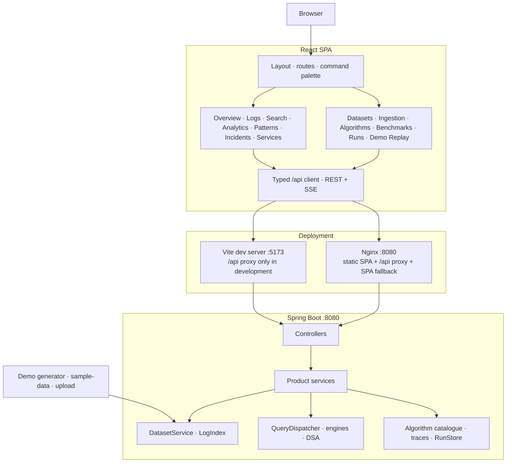

# Architecture Diagram

The current branch uses the following runtime shape. The detailed contract is in [ARCHITECTURE.md](ARCHITECTURE.md).

## Verified current facts

- 42 catalogue entries across six modules.
- 35 registered query engines and 13 traceable algorithms.
- One current in-memory dataset; no database.
- Two SSE surfaces: `/api/live` replay and `/api/runs/{id}/events` recorded replay. One `ReplayProvider` subscription backs both Demo Replay views in the frontend.
- `/api/overview` returns a selected window anchored on the newest event timestamp, with `windowStart`, `windowEnd`, `scope`, window-scoped counts and the unfiltered `datasetEvents` total.
- `/api/analytics/dependencies` returns observed `requestId` adjacency over the full current dataset, not verified infrastructure topology and not scoped to the Command Center window. The frontend renders it as SVG, with an optional 2.5D CSS `perspective` + `rotateX` depth mode; there is no WebGL context or 3D engine.
- Runtime status comes from `/api/health/status`. The overview DTO's `systemStatus` is a hardcoded compatibility string.
- Nginx proxies `/api/` and falls back unknown non-API paths to `index.html`.
- Vite remains the local `/api` development proxy.
- No WebGL/3D engine, WebSocket client, external research integration or production telemetry collector.
- Container image builds and runtime smoke tests were never executed: the Docker daemon is unavailable in the audit environment.
