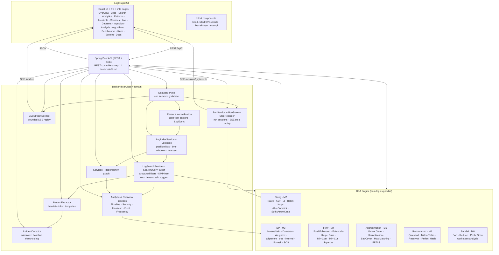
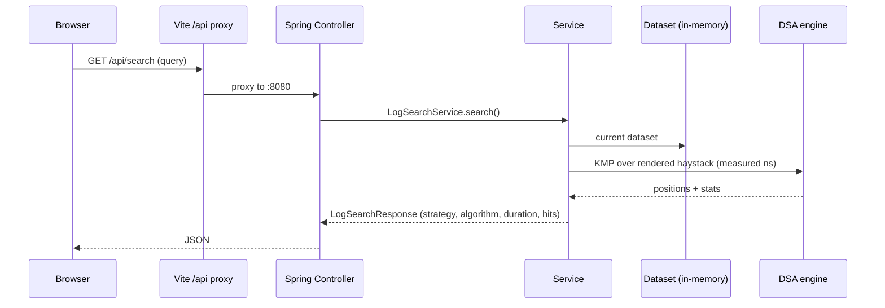
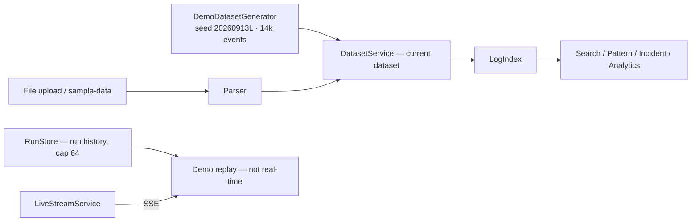

# LogInsight Analyzer — Architecture Diagram

Mermaid rendering of the implemented architecture (commit `bbf5e45`). Every node corresponds to a
real package or service in the repository; see [PROJECT_WALKTHROUGH.md](PROJECT_WALKTHROUGH.md) and
[API.md](API.md) for the matching detail.

## Flow of one request

## Where data lives

## Verified numbers used by the UI

- **35** engines registered · **42** catalogue algorithms · **36** exposed · **13** traceable.
- **6** catalogue modules: M2 Strings (9), M3 DP (12), M4 Flow (6), M5 Approximation (7),
  M6 Randomized (5), M6 Parallel (3).
- Demo corpus: **14,000** deterministic events across **~8 services**.
- Test gate: **732 tests / 0 failures / 0 errors**.